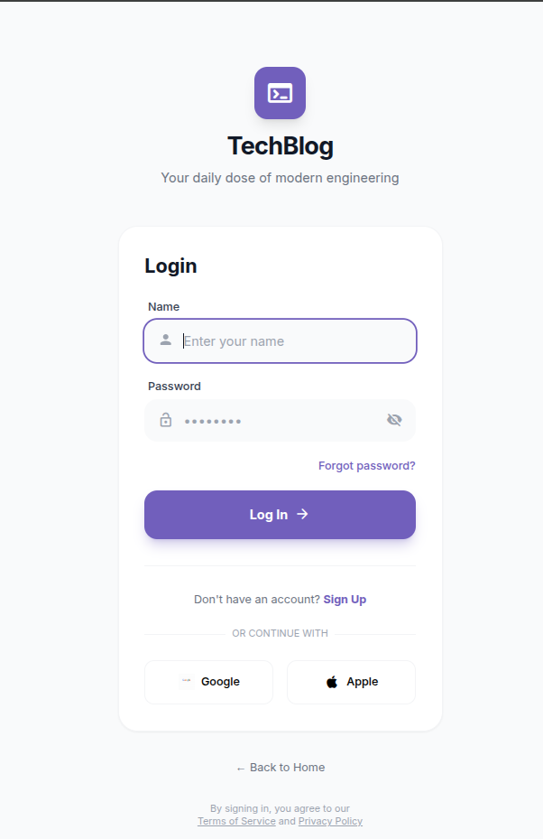

# TechBlog - Modern Laravel Blog Application

A beautiful and modern blog application built with Laravel and Tailwind CSS, featuring a sleek iOS-inspired design, user authentication, and comprehensive post management.


## ✨ Features

### 🎨 Modern UI Design
- **iOS-Inspired Interface** - Clean, minimal design with smooth animations
- **Dark Mode Support** - Toggle between light and dark themes
- **Mobile-First Responsive** - Optimized for all screen sizes
- **Material Icons** - Beautiful icon set throughout the application
- **Card-Based Layout** - Modern content presentation

### 🔐 User Authentication
- User registration with validation
- Secure login system
- Session management
- Protected routes with middleware
- Social login UI (Google, Apple)

### 📝 Blog Post Management
- Create new blog posts with rich content
- Edit your own posts with modern form design
- Delete posts with confirmation
- View all posts with author information
- Category selection and organization
- Read time estimation

### 🎯 User Experience
- Author avatars with initials
- Post filtering and categories
- Bookmark and share functionality
- Writing tips and guidance
- Clean navigation with bottom tab bar
- Search functionality

## 📸 Screenshots

### Homepage

*Modern card-based blog feed with dark mode support*

### Login Page

*Clean authentication interface with social login options*

### Create Post

*Intuitive post creation with helpful writing tips*

### Edit Post

*Easy-to-use post editor matching the app's design*

## 🚀 Quick Start

## Requirements

- PHP 8.1 or higher
- Composer
- MySQL or PostgreSQL database
- Node.js & NPM (optional, for Vite assets)

## Installation

1. Clone the repository:
   ```bash
   git clone <repository-url>
   cd laravel-blog-web
   ```

2. Install PHP dependencies:
   ```bash
   composer install
   ```

3. Install JavaScript dependencies:
   ```bash
   npm install
   ```

4. Create environment file:
   ```bash
   cp .env.example .env
   ```

5. Generate application key:
   ```bash
   php artisan key:generate
   ```

6. Configure your database in `.env`:
   ```
   DB_CONNECTION=mysql
   DB_HOST=127.0.0.1
   DB_PORT=3306
   DB_DATABASE=your_database_name
   DB_USERNAME=your_database_user
   DB_PASSWORD=your_database_password
   ```

7. Run database migrations:
   ```bash
   php artisan migrate
   ```

8. (Optional) Seed the database with sample data:
   ```bash
   php artisan db:seed
   ```

## 📱 Usage

1. Start the development server:
   ```bash
   php artisan serve
   ```

2. Visit `http://localhost:8000` in your browser

3. **Register a new account:**
   - Click the person icon or "Register" button
   - Fill in your name, email, and password
   - Submit to create your account

4. **Create your first post:**
   - Click the floating "+" button
   - Add a title and content
   - Select a category (optional)
   - Click "Publish Post"

5. **Manage your posts:**
   - Edit or delete your own posts using the icons
   - View all posts on the homepage
   - Toggle dark mode with the moon icon

## 🎨 Design Features

### Color Scheme
- **Primary Color:** `#715fbc` (Purple)
- **Light Mode:** Clean white backgrounds with subtle grays
- **Dark Mode:** Deep slate backgrounds for comfortable reading

### Typography
- **Font Family:** Inter (Google Fonts)
- **Modern, clean sans-serif design**
- **Optimized for readability**

### Components
- **Card-based post layout**
- **Rounded corners (12px-24px)**
- **Smooth transitions and hover effects**
- **iOS-style blur effects**
- **Material Design icons**

## Project Structure

```
laravel-blog-web/
├── app/
│   ├── Http/Controllers/
│   │   ├── PostController.php      # Blog post CRUD operations
│   │   └── UserController.php      # Authentication & user management
│   └── Models/
│       ├── Post.php                 # Post model with user relationship
│       └── User.php                 # User model with posts relationship
├── database/
│   └── migrations/
│       ├── create_users_table.php
│       └── create_posts_table.php
├── resources/views/
│   ├── welcome.blade.php            # Homepage with posts feed
│   ├── login.blade.php              # Login page
│   ├── register.blade.php           # Registration page
│   ├── create-post.blade.php        # Post creation form
│   └── edit-post.blade.php          # Post editing form
└── routes/
    └── web.php                       # Application routes
```

## Key Features Implementation

### 🔒 Authentication & Authorization
- Secure user registration with validation
- Login with name/email and password
- Session-based authentication
- Middleware protection for authenticated routes
- Users can only edit/delete their own posts

### 📄 Post Management
- Rich text content support
- Category organization
- Author attribution with avatars
- Created/updated timestamps
- Read time calculation
- CSRF protection on all forms

### 🎭 User Interface
- **Bottom Navigation:**
  - Home
  - Explore (placeholder)
  - Create Post (floating button)
  - Saved (placeholder)
  - Settings (placeholder)
  
- **Header:**
  - TechBlog logo with icon
  - Search functionality
  - User profile/logout button
  
- **Post Cards:**
  - Author badge and avatar
  - Read time estimation
  - Edit/delete buttons (for post owners)
  - Bookmark and share options

## 🛠 Technologies Used

- **Backend:** Laravel 11.x (PHP Framework)
- **Frontend:** Blade Templates + Tailwind CSS 3.x
- **Database:** MySQL/PostgreSQL with Eloquent ORM
- **Icons:** Material Icons (Google)
- **Fonts:** Inter (Google Fonts)
- **Authentication:** Laravel's built-in auth system
- **Styling:** Tailwind CSS via CDN

## 🔄 API Routes

| Method | URI | Action | Middleware |
|--------|-----|--------|------------|
| GET | / | Display all posts | - |
| GET | /login | Show login form | - |
| POST | /login | Process login | - |
| GET | /register | Show registration form | - |
| POST | /register | Process registration | - |
| POST | /logout | Log out user | auth |
| GET | /createpost | Show create form | auth |
| POST | /createpost | Store new post | auth |
| GET | /edit-post/{id} | Show edit form | auth |
| PUT | /edit-post/{id} | Update post | auth |
| DELETE | /delete-post/{id} | Delete post | auth |

## 📝 Database Schema

### Users Table
- id
- name
- email (unique)
- password
- timestamps

### Posts Table
- id
- user_id (foreign key)
- title
- body
- timestamps

## 🎯 Future Enhancements

- [ ] Image upload for posts
- [ ] Comment system
- [ ] Like/reaction system
- [ ] Post search functionality
- [ ] User profiles with bio
- [ ] Email verification
- [ ] Password reset
- [ ] Rich text editor (Markdown/WYSIWYG)
- [ ] Post tags and advanced filtering
- [ ] Social sharing integration
- [ ] Analytics dashboard

## 📄 License

This project is open-sourced software licensed under the [MIT license](https://opensource.org/licenses/MIT).

## 👨‍💻 Author

Created with ❤️ using Laravel and Tailwind CSS

---

**Note:** Remember to create a `screenshots` folder in your project root and add actual screenshots of your application for the images referenced in this README.
