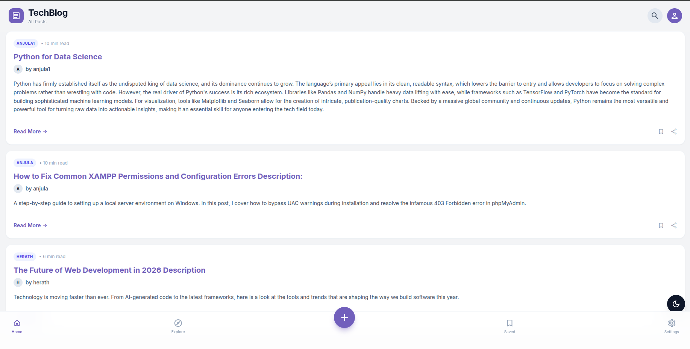
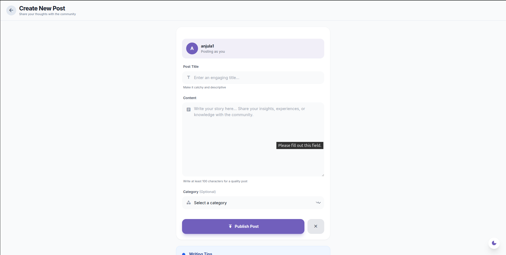
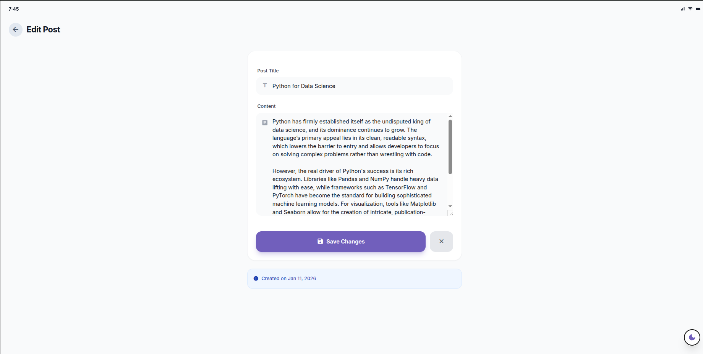

# TechBlog - Modern Laravel Blog Application

A beautiful and modern blog application built with Laravel and Tailwind CSS, featuring a sleek iOS-inspired design, user authentication, and comprehensive post management.



## ✨ Features

### 🎨 Modern UI Design
- **iOS-Inspired Interface** - Clean, minimal design with smooth animations
- **Dark Mode Support** - Toggle between light and dark themes
- **Mobile-First Responsive** - Optimized for all screen sizes
- **Material Icons** - Beautiful icon set throughout the application
- **Card-Based Layout** - Modern content presentation

### 🔐 User Authentication
- User registration with validation
- Secure login system
- Session management
- Protected routes with middleware
- Social login UI (Google, Apple)

### 📝 Blog Post Management
- Create new blog posts with rich content
- Edit your own posts with modern form design
- Delete posts with confirmation
- View all posts with author information
- Category selection and organization
- Read time estimation

### 🎯 User Experience
- Author avatars with initials
- Post filtering and categories
- Bookmark and share functionality
- Writing tips and guidance
- Clean navigation with bottom tab bar
- Search functionality

## 📸 Screenshots

### Homepage

*Modern card-based blog feed with dark mode support*

### Login Page

*Clean authentication interface with social login options*

### Create Post

*Intuitive post creation with helpful writing tips*

### Edit Post

*Easy-to-use post editor matching the app's design*

## 🚀 Quick Start

## Requirements

- PHP 8.1 or higher
- Composer
- MySQL or PostgreSQL database
- Node.js & NPM (optional, for Vite assets)

## Installation

1. Clone the repository:
   ```bash
   git clone <repository-url>
   cd laravel-blog-web
   ```

2. Install PHP dependencies:
   ```bash
   composer install
   ```

3. Install JavaScript dependencies:
   ```bash
   npm install
   ```

4. Create environment file:
   ```bash
   cp .env.example .env
   ```

5. Generate application key:
   ```bash
   php artisan key:generate
   ```

6. Configure your database in `.env`:
   ```
   DB_CONNECTION=mysql
   DB_HOST=127.0.0.1
   DB_PORT=3306
   DB_DATABASE=your_database_name
   DB_USERNAME=your_database_user
   DB_PASSWORD=your_database_password
   ```

7. Run database migrations:
   ```bash
   php artisan migrate
   ```

## Usage

1. Start the development server:
   ```bash
   php artisan serve
   ```

2. Visit `http://localhost:8000` in your browser

3. Register a new account or log in

4. Start creating and managing your blog posts!

## Project Structure

- `app/Http/Controllers/` - Application controllers
  - `PostController.php` - Handles blog post operations
  - `UserController.php` - Handles user authentication
- `app/Models/` - Eloquent models
  - `Post.php` - Blog post model
  - `User.php` - User model
- `database/migrations/` - Database migrations
- `resources/views/` - Blade templates
  - `home.blade.php` - Main page with posts listing
  - `edit-post.blade.php` - Post editing page
- `routes/web.php` - Web routes

## Key Features Implementation

### Authentication
- Users can register with name, email, and password
- Login functionality with session management
- Logout capability

### Post Management
- Only authenticated users can create posts
- Users can only edit and delete their own posts
- Posts display author information
- CSRF protection on all forms

## Technologies Used

- **Laravel** - PHP web application framework
- **Blade** - Laravel's templating engine
- **Eloquent ORM** - Database interactions
- **Custom CSS** - Modern, gradient-based styling

## License

This project is open-sourced software licensed under the [MIT license](https://opensource.org/licenses/MIT).
